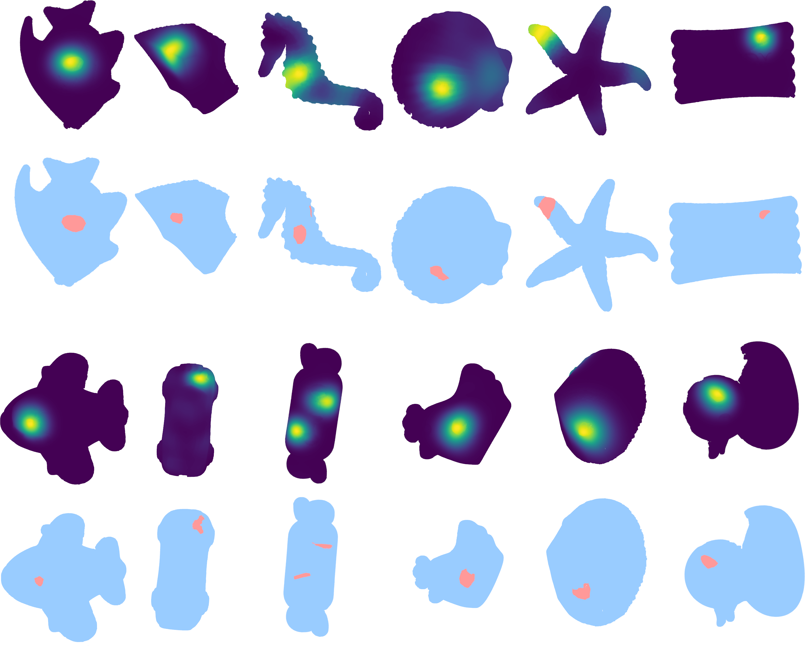
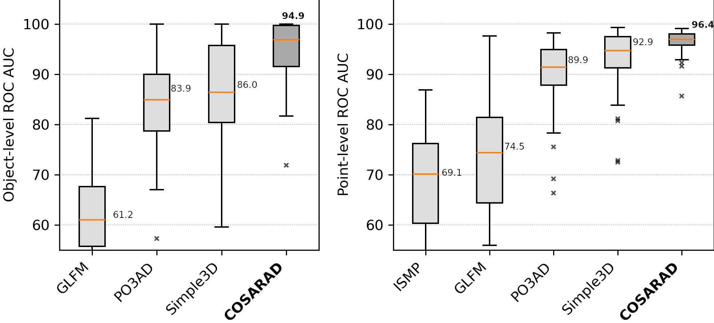
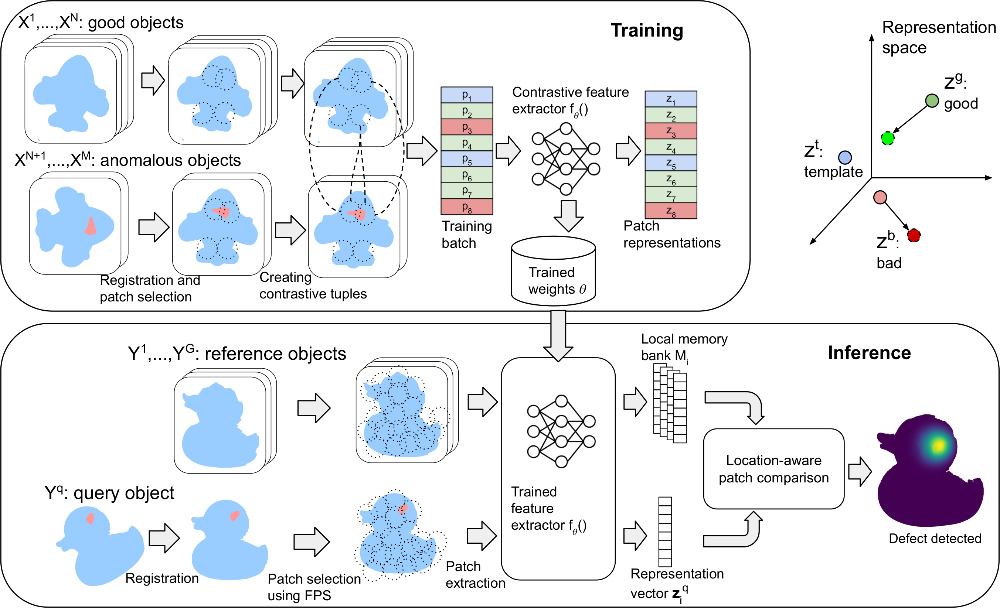

# COSSAD: COntrastive Spatial-aware Shape Anomaly Detection



Reference implementation for the paper:

> **The Good, the Bad, and the Template: Contrastive Anomaly Detection in 3D**
> Alexander Tarvo, Colin Acton, Yusen Wan, Xu Chen
> *ICPR 2026*

**To reproduce the results reported in the ICPR'26 paper, see [Reproduction Guide](doc/REPRODUCTION_GUIDE.md).**

COSSAD detects geometric defects — cracks, holes, bulges — in 3D point clouds of manufactured parts. It compares a test shape against a set of defect-free reference shapes using contrastive feature extraction and spatially-aware patch comparison.

## Key results

We train and evaluate COSSAD on two public datasets: [Real3D-AD](https://github.com/M-3LAB/Real3D-AD) and [Anomaly-ShapeNet v.2](https://github.com/Chopper-233/Anomaly-ShapeNet). Accuracy is measured as O-ROCAUC (object-level detection) and P-ROCAUC (point-level localization) under 12-fold cross-validation.

### Real3D-AD

Results reported as O-ROC / P-ROC. **Bold** = best, *italic* = second best.

| Object | Reg3D-AD | PO3AD | Simple3D | MC3D-AD | PointCore | COSSAD |
|--------|----------|-------|----------|---------|-----------|--------|
| Airplane | 71.6/63.1 | 80.4/- | 76.5/*88.1* | *85.0*/62.8 | 66.0/60.8 | **91.2**/**96.4** |
| Candybar | 82.7/72.2 | 78.5/- | 85.1/*96.2* | 77.8/73.6 | *97.6*/76.0 | **99.9**/**98.2** |
| Car | 69.7/71.8 | 65.4/- | **98.1**/**99.2** | 74.9/81.9 | 86.6/70.6 | *96.5*/*98.2* |
| Chicken | *85.2*/67.6 | 68.6/- | 82.6/*86.1* | 71.5/64.0 | 84.1/78.0 | **85.4**/**87.4** |
| Diamond | 90.0/83.5 | 80.1/- | **100**/**99.0** | 95.5/94.2 | *96.3*/81.0 | **100**/*97.5* |
| Duck | 58.4/50.3 | 82.0/- | 78.7/*96.6* | *83.1*/82.2 | 68.4/71.2 | **94.8**/**97.0** |
| Fish | 91.9/85.2 | 85.9/- | 91.2/**99.6** | 91.2/90.6 | *99.2*/78.2 | **99.4**/*96.2* |
| Gemstone | 41.7/54.5 | 69.3/- | 70.4/**97.3** | 56.0/45.8 | 53.4/51.5 | **97.1**/*97.4* |
| Seahorse | 76.2/81.7 | 75.6/- | **93.0**/*94.2* | 90.1/**95.0** | *97.3*/84.1 | 80.5/96.5 |
| Shell | 35.8/81.1 | 80.0/- | *85.1*/**97.6** | 51.5/47.1 | **86.1**/78.1 | 79.1/*91.2* |
| Starfish | 50.6/71.7 | 75.8/- | 69.5/85.8 | 76.6/69.0 | 65.2/73.6 | **84.4**/**95.0** |
| Toffees | 68.5/75.9 | 77.1/- | *88.9*/**96.8** | 78.3/*93.4* | **92.9**/74.5 | 88.7/92.5 |
| **Mean** | 70.4/70.5 | 76.7/83.6 | 80.4/*92.3* | 78.2/76.8 | *82.9*/73.1 | **91.6**/**95.3** |

### Anomaly-ShapeNet



## Architecture



COSSAD operates in two stages: contrastive encoder training and spatially-aware inference.

**Training.** All point clouds are registered into a common coordinate frame. Small patches are extracted and arranged into contrastive tuples containing both anomaly-free ("good") and anomalous ("bad") patches from the same spatial location. A feature extractor based on the RIConv++ rotation-invariant backbone is trained with multi-similarity contrastive loss to produce embeddings that cluster good patches together and separate anomalous ones.

**Inference.** Reference (defect-free) shapes are registered and their patch features are stored in local memory banks — one per spatial location. A test object is registered into the same frame, and its patches are compared only against the memory bank at the corresponding location. This spatially-aware comparison produces per-point anomaly scores and an overall object-level score.

## Quick start

### Requirements

- Docker Engine 23.0+ with Compose V2
- NVIDIA Container Toolkit
- GPU with 32+ GB VRAM (training) or 16+ GB (inference)
- ~100 GB disk space for data

### 1. Clone and build

```bash
git clone https://github.com/alextarvo/cossad
cd cossad

./docker/build.sh cu124    # RTX 2060-4090, A100, H100
# or
./docker/build.sh cu128    # RTX 5090 (Blackwell)
```

### 2. Download data

Download and extract to your data directory (e.g. `/mnt/data/cossad`):

```bash
mkdir -p /mnt/data/cossad && cd /mnt/data/cossad

# Inference data (required)
curl -O https://pub-c3e1c2ecdbd44fc6bf5a8c091a3c3536.r2.dev/template.tar
curl -O https://pub-c3e1c2ecdbd44fc6bf5a8c091a3c3536.r2.dev/train.tar
tar -xf template.tar && tar -xf train.tar

# Training data (required for training from scratch)
curl -O https://pub-c3e1c2ecdbd44fc6bf5a8c091a3c3536.r2.dev/supcon_train_r2_2025_11_04_real3dad_norot.tar
curl -O https://pub-c3e1c2ecdbd44fc6bf5a8c091a3c3536.r2.dev/supcon_train_r2_2025_11_04_shapenet_norot.tar
tar -xf supcon_train_r2_2025_11_04_real3dad_norot.tar
tar -xf supcon_train_r2_2025_11_04_shapenet_norot.tar
```

Update the data volume mount in `docker/docker-compose.yml` if your data is not at `/mnt/data/cossad`.

### 3. Train and evaluate

```bash
# Enter the container
HOST_UID=$(id -u) HOST_GID=$(id -g) docker compose -f docker/docker-compose.yml \
    run --rm cossad-cu124 bash

# Inside the container:

# Full reproduction: train 12 folds, evaluate, compare to baseline (~24-48h)
python scripts/run_train_eval_pipeline.py full

# Quick sanity check: 2 folds, 10 epochs (~30 min)
python scripts/run_train_eval_pipeline.py smoke

# Preview commands without running
python scripts/run_train_eval_pipeline.py full --dry-run
```

### 4. Evaluate with existing weights

```bash
# Inside the container — use the run ID printed during training:
python scripts/run_train_eval_pipeline.py eval \
    --weights-run-id Train_YYYYMMDD_HHMMSS
```

### 5. Single object test

```bash
python pipeline_reg_based.py \
    --cossad_data_path=/data \
    --object_class=airplane \
    --encoder=riconv2 \
    --contrastive_encoder_path=/data/model_weights/<RUN_ID>/train_classes_3/best_riconv2.pth \
    --patch_radius=2 \
    --filter_by_point_count \
    --output_results_path=/data/predictions/test
```

## Repository structure

```
contrastive_learner_v3.py     Training entry point (Hydra)
pipeline_reg_based.py         Inference and evaluation entry point
configs/                      Hydra training configuration
dataloaders/                  Dataset loaders for Real3D-AD, Anomaly-ShapeNet
feature_extractors/           Encoder wrappers (RIConv++, PointNet++)
registration/                 ICP-based point cloud registration
external/                     Third-party backbones (RIConv2, PointNet2, PatchCore)
scripts/
  run_train_eval_pipeline.py  Pipeline runner (train + eval + compare)
  compare_models.py           Statistical comparison (Mann-Whitney U)
utils/                        Point cloud ops, logging, GradNorm
docker/                       Dockerfile, docker-compose, environment
doc/                          Detailed documentation
```

## Documentation

- [Training](doc/training.md) — contrastive encoder training, Hydra configuration
- [Evaluation](doc/evaluation.md) — inference, cross-validation, accuracy metrics
- [Pipeline runner](doc/training_validation_pipeline.md) — automated train/eval/compare workflow
- [Dataset format](doc/dataset.md) — data layout, NPZ file contents, download links
- [Environment setup](doc/environment.md) — Docker build and GPU requirements

## Datasets

COSSAD is trained and evaluated on:
- [Real3D-AD](https://github.com/M-3LAB/Real3D-AD) — real scanned industrial parts (partial point clouds)
- [Anomaly-ShapeNet v.2](https://github.com/Chopper-233/Anomaly-ShapeNet) — synthetic 3D shapes with injected anomalies

We thank the authors and maintainers of these datasets for their contributions.

## Troubleshooting

**First run is slow.** The RIConv++ CUDA kernels (`pointops`) compile on first use (~1-2 min). Cached for subsequent runs.

**Permission errors in Docker.** Ensure `HOST_UID` and `HOST_GID` are set:
```bash
export HOST_UID=$(id -u) HOST_GID=$(id -g)
```

**GPU not detected.** Verify NVIDIA Container Toolkit:
```bash
docker run --rm --gpus all nvidia/cuda:12.4.1-base-ubuntu22.04 nvidia-smi
```

## Citation

```bibtex
@inproceedings{tarvo2026cossad,
  title     = {The Good, the Bad, and the Template: Contrastive Anomaly Detection in 3D},
  author    = {Alexander Tarvo, Colin Acton, Yusen Wan, Xu Chen},
  booktitle = {IEEE International Conference on Pattern Recognition (ICPR)},
  year      = {2026}
}
```

## License

This work is licensed under [CC BY-NC-SA 4.0](https://creativecommons.org/licenses/by-nc-sa/4.0/). See [LICENSE](LICENSE) for the full text. Commercial use is not permitted.

## Contact

For questions or issues, please contact Alexander Tarvo (alextarvo@gmail.com) or open an issue on this repository.
